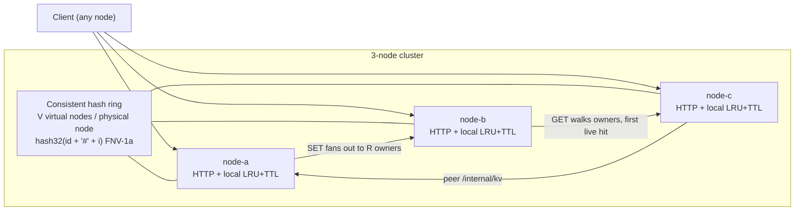

# ringcache

Distributed **in-memory** cache. One Go process per node, a consistent-hash ring with virtual nodes, per-node LRU+TTL, and synchronous replication (`R=2`).

**Consistency in one line:** a SET is successful when `acked ≥ 1`. That is **not** linearizable, **not** a quorum, and **not** durable. Replication is R=2 synchronous fan-out; last-writer-wins on coordinator `written_at`; nothing is written to disk.

This is a systems MVP, not a product: no auth, no gossip membership, no WAL. Numbers below were **measured** on this machine, not invented.



A client talks to **any** node. That node is the coordinator: it hashes the key, picks `R` clockwise owners, and either serves the local store or RPCs `/internal/kv` on peers. Internal RPCs never re-coordinate, so there is no proxy loop.

---

## 60-second run

Needs Go 1.22+ and `curl`. Docker is optional.

```bash
git clone https://github.com/hiroshi-os/ringcache && cd ringcache
./scripts/quickstart.sh
```

That builds `bin/ringcache`, starts **node-a/b/c** on `127.0.0.1:8080-8082`, SETs `user:1`, and GETs it from another coordinator.

Same thing by hand:

```bash
make cluster          # 127.0.0.1:8080-8082
curl -sS -X PUT http://127.0.0.1:8080/v1/set \
  -H 'Content-Type: application/json' \
  -d '{"key":"user:1","value":"ok","ttl_ms":60000}'
curl -sS 'http://127.0.0.1:8081/v1/get?key=user:1'
./scripts/failure-demo.sh     # A: kill replica, still hit; B: partial ACK then miss
./scripts/rebalance-demo.sh   # join/leave remaps ~1/N primaries
make stop
```

### Docker Compose (optional)

```bash
docker compose up --build
```

Host ports: `node-a :8080`, `node-b :8081`, `node-c :8082`. Compose uses `network_mode: host` so the three processes can replicate over loopback (a Docker bridge on this nested CI VM drops 100% of veth-to-veth packets). On Docker Desktop (Mac/Windows), host networking is ignored — use `make cluster`.

Single node (self is implied if `-peers` is empty):

```bash
go run ./cmd/ringcache -id node-a -listen :8080
```

---

## API

JSON, no auth. `ttl_ms: 0` or omitted means **no expiry**.

```bash
# SET — HTTP 200 means acked≥1, not “all replicas applied”
curl -sS -X PUT http://127.0.0.1:8080/v1/set \
  -H 'Content-Type: application/json' \
  -d '{"key":"user:1","value":"ok","ttl_ms":60000}'

# GET (any node)
curl -sS 'http://127.0.0.1:8081/v1/get?key=user:1'

# DELETE
curl -sS -X DELETE 'http://127.0.0.1:8082/v1/delete?key=user:1'

# who owns this key?
curl -sS 'http://127.0.0.1:8080/ring?key=user:1'

curl -sS http://127.0.0.1:8080/health
curl -sS http://127.0.0.1:8080/stats
```

Aliases without the `/v1` prefix (`/get`, `/set`, `/delete`) do the same thing.

| Method | Path | Notes |
| --- | --- | --- |
| `GET` | `/v1/get?key=` | 200 hit, 404 miss, 503 no replica reachable |
| `PUT`/`POST` | `/v1/set` | body `{key,value,ttl_ms}` — **200 if `acked≥1`**, else 503 |
| `DELETE` | `/v1/delete?key=` | best-effort delete on all owners |
| `GET` | `/internal/kv` | local store only (replication path) |
| `GET`/`POST`/`DELETE` | `/admin/members` | local ring membership only — **not gossip** |

SET response (honest about partial writes):

```json
{"key":"user:1","acked":2,"replicas":["node-c","node-a"],"failed":[]}
```

---

## Consistent hashing (virtual nodes)

Each physical node is placed on the ring **V times** (default `V=150`, flag `-vnodes` / `RINGCACHE_VNODES`).

Virtual node `i` of node `id` is:

```text
hash32(id + "#" + i)     // FNV-1a 32-bit, i in [0, V)
```

A key walks **clockwise** from `hash32(key)` and collects the first `R` **distinct** physical nodes. Those are the owners.

Why virtual nodes: one point per node makes arcs (and therefore key load) wildly uneven. `V=150` chops the circle so each node owns many small arcs. Adding a node remaps about `1/N` of primaries, not a whole neighbor's slice. Tests in `internal/ring` check determinism, uniqueness, spread, join remap, and leave remap. Live join/leave: `./scripts/rebalance-demo.sh`.

---

## Consistency model

Read this before citing the demo as “HA cache.”

| What a 200 SET means | What it does not mean |
| --- | --- |
| ≥1 of the R owners applied the write | Linearizable or sequential consistency |
| The coordinator finished (or timed out) a **sync fan-out to all R owners** | Quorum `R+W>N`, or “the cluster has the key” |
| Last-writer-wins on coordinator `written_at` (unix-nano) | Compare-and-swap / transactions |
| GET returns the first live owner with a non-expired value | Read-your-writes from an arbitrary node |
| Opportunistic read-repair of other owners | Anti-entropy, hinted handoff, or key migration on join |
| 2s fail-open breaker after a peer error | Failure detection / membership |

**Defaults:** `R=2`, replica RPC timeout 200ms. The coordinator **always waits for every owner RPC** (or timeout). HTTP 200 is `acked ≥ 1`, **not** `acked == R`.

**There is no persistence.** Restart = empty. No WAL, snapshot, or disk.

**Failure modes that actually happen:**

1. SET acks 1 of 2. Kill that replica → GET misses even though another node is “up.”
2. Two coordinators SET the same key concurrently → replicas can diverge until the next write or read-repair.
3. TTL is computed on the receiving node (`now + ttl_ms`). Clock skew moves expiry.
4. Membership is **per process**. A dead node stays on the ring until someone `DELETE /admin/members`. Peers skip it briefly, then retry and eat the timeout.
5. Join/leave remaps ~`1/N` primaries. The newly responsible node starts **empty** — we do not move values.

Caches hide this with TTL. Do not put a source of truth here.

---

## LRU + TTL (per node)

- Capacity is a **max key count** (`-capacity` / `RINGCACHE_CAPACITY`, default 10000), not bytes.
- GET moves a live key to MRU. SET of a new key evicts the LRU if the map is full.
- Expired keys miss on GET (lazy) and are swept once a second. Until swept they still occupy a slot.
- Older replica writes (`written_at` smaller) are ignored so a delayed retry cannot clobber a newer value.

---

## Failure demo

```bash
./scripts/failure-demo.sh            # local 3-process cluster
./scripts/failure-demo.sh --compose  # compose already up, or starts it
```

The key picker reads **`owners[]` only**. Grepping the whole `/ring` body matches `"node-b"` in the cluster node list and is wrong.

**Scenario A — full ACK, kill one replica (expect HIT).** Pick a key whose `owners[]` include node-b. SET via node-a. Kill node-b. GET on :8080 and :8082 still hits the surviving owner. `:8081` stops accepting connections. This is **not** “the cluster heals”; the dead id remains on the ring.

**Scenario B — partial ACK, then kill the only copy (expect MISS).** Kill node-b first. SET a key owned by `{node-a, node-b}` → `acked=1`, `failed=["node-b"]`, HTTP 200. Kill node-a. GET via node-c misses (both owners down). Success is `acked≥1`, not durability.

---

## Join / leave rebalance

```bash
./scripts/rebalance-demo.sh
```

Starts **node-d** on `:8083` and `POST /admin/members` on node-a/b/c (membership is local, not gossip). Samples 2000 primaries via `/ring?key=` before and after; expects ~`1/4` remapped (`N=3→4`). Leave restores the 3-node placement. Newly responsible nodes do **not** receive old values.

---

## Bench (measured, not estimated)

Harness: `cmd/bench` — real HTTP PUT `/v1/set` and GET `/v1/get` against all three nodes, 32 workers, 4000 ops/phase, 1000-key working set, 60s TTL.

```bash
./scripts/bench.sh
```

### Run recorded here

| | |
| --- | --- |
| Date (UTC) | 2026-09-13T09:29:48Z |
| Hardware | Linux 6.12.94+ x86_64, 4 vCPU, Intel Xeon, ~16 GiB RAM (Cursor Cloud Agent VM) |
| Go | go1.22.2 linux/amd64 |
| Cluster | 3 processes on loopback (`127.0.0.1:8080-8082`), `R=2`, `V=150`, cap 10000 |
| Load | `cmd/bench -n 4000 -c 32 -keys 1000` (real HTTP, not in-process) |

| Phase | ok | errors | wall | ops/s | p50 | p95 | p99 | max | mean |
| --- | --- | --- | --- | --- | --- | --- | --- | --- | --- |
| SET | 4000 | 0 | 312ms | **12820** | 2.28ms | 4.76ms | 6.56ms | 10.18ms | 2.48ms |
| GET | 4000 | 0 | 129ms | **31027** | 0.82ms | 2.68ms | 3.91ms | 5.84ms | 1.02ms |

These are **this VM, this commit, loopback**. Docker NAT, a laptop, or a noisy neighbor will differ. Do not cite them as product SLOs. Re-run `./scripts/bench.sh` and replace the table if you need numbers for a different machine.

`docker compose up --build` was also run on this VM (host network). SET acked 2/2; after `compose stop node-b` on a key owned by node-b, GET on :8080 and :8082 still hit `node-a`.

---

## Tests

```bash
go test ./... -race -count=1
# or
make ci
```

- `internal/ring` — deterministic owners, unique replicas, vnode count, key spread, join/leave remap ~1/N
- `internal/store` — LRU order, TTL expiry, LWW stale-write ignore, capacity-1 eviction
- `internal/node` — 3-node `httptest` SET/GET/DELETE, partial ACK when an owner is down, join/leave

CI (GitHub Actions) runs `gofmt`, `go vet`, `-race` tests, then `failure-demo.sh` and `rebalance-demo.sh` against `make cluster`.

---

## Config

| Flag | Env | Default |
| --- | --- | --- |
| `-id` | `RINGCACHE_ID` | `node-a` |
| `-listen` | `RINGCACHE_LISTEN` | `:8080` |
| `-peers` | `RINGCACHE_PEERS` | `id=url,id=url,…` (self required in a cluster) |
| `-replicas` | `RINGCACHE_REPLICAS` | `2` |
| `-capacity` | `RINGCACHE_CAPACITY` | `10000` |
| `-vnodes` | `RINGCACHE_VNODES` | `150` |
| `-replica-timeout-ms` | `RINGCACHE_REPLICA_TIMEOUT_MS` | `200` |

---

## Honesty / non-goals

- Not Redis, not Memcached, not Dynamo. No persistence, pub/sub, Lua, clusterslots, or gossip.
- No TLS, ACLs, or multi-tenancy.
- Values are JSON strings, max 1 MiB; keys max 512 bytes.
- No byte-based memory cap; RSS can exceed `capacity` × value size.
- No cross-key transactions, scans, or CAS (beyond LWW timestamps).
- Single-threaded-looking correctness under a mutex per store; the hot path is still local RAM + HTTP.
- Zero LLM / AI wrappers. The binary is `net/http` + maps.

---

## Resume bullets

> **DRAFT** — do not paste onto a résumé until you have run the demo yourself and can defend every number and failure mode.

- **DRAFT.** Built a 3-node Go in-memory cache with consistent hashing (`V` virtual nodes, FNV-1a), per-node LRU+TTL, and `R=2` synchronous fan-out; coordinators report `acked`/`failed` and treat success as `acked≥1` (not linearizable, not a quorum, no persistence).
- **DRAFT.** Measured real HTTP SET/GET throughput and p99 on a 3-node loopback cluster and documented single-replica-kill vs partial-ACK-then-kill: reads continue only when a surviving replica acked the write (last-writer-wins).
